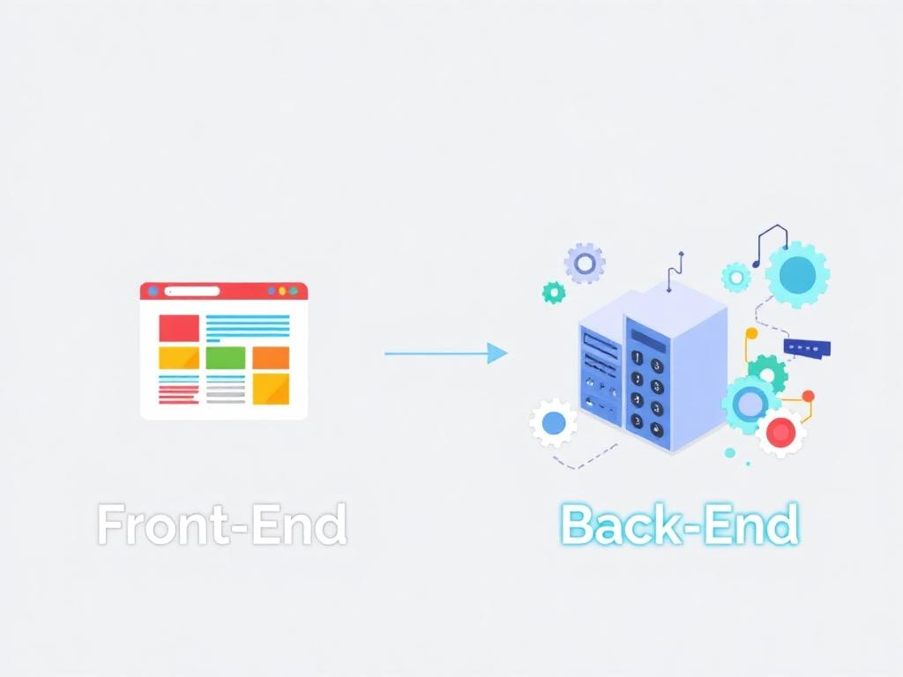

# HTTP Request and Response

The requesting computer, called the "client," asks another computer, known as the "server," for specific information. The server then processes the request and sends back a response containing the requested information.

---


---

## What is HTTP/HTTPS and Why Do URLs Start With It?

URLs that start with HTTP (Hypertext Transfer Protocol) or HTTPS (HTTP Secure) indicate the protocol used for communication between the browser and the server.

- **HTTP**: This is a protocol for transferring data in plain text, mainly used for accessing web pages. However, it does not provide security, meaning the data can be intercepted by third parties.

- **HTTPS**: A more secure version of HTTP. It uses encryption through SSL/TLS certificates to protect data during transfer, ensuring that information like passwords and personal details remain secure.

---

### Are HTTP/HTTPS the Only Protocols Used?

No, *HTTP/HTTPS are the most common protocols for web browsing*, but there are other protocols for specific purposes, such as:

- **FTP (File Transfer Protocol)**: For transferring files.
- **SMTP (Simple Mail Transfer Protocol)**: Used for sending emails.
- **WS/WSS (WebSocket/Secure WebSocket)**: For real-time communication.
- **FTP/SFTP (Secure File Transfer Protocol)**: A secure version of FTP.

Each protocol is chosen based on the type of communication and the required level of security.

---

## Understanding Front-End and Back-End in Software Development

**Front-End** is the part of an application that users interact with directly. It’s what you see on the screen, like buttons, text, images, forms, and overall design. It’s built using technologies like:

- **HTML**: Defines the structure of a webpage (e.g., headings, paragraphs, links).
- **CSS**: Styles the page, controlling colors, fonts, and layout.
- **JavaScript**: Adds interactivity, like animations or dynamic content updates.

Think of the front-end as the "face" of the application that users experience.

**Back-End** is the "behind-the-scenes" part of the application. It handles the logic, database interactions, and server-side processes that make the front-end work. It’s responsible for storing, processing, and managing data. Common back-end technologies include:

- **Programming Languages**: Java, Python, Node.js, etc.
- **Databases**: MySQL, PostgreSQL, MongoDB.
- **APIs**: Connect the front-end to the back-end to exchange information.

The back-end is like the engine of a car—it powers everything but isn’t visible to the user.

In simple terms:

```
    Front-end: What the user sees and interacts with.
    Back-end: The logic and data management that supports the front-end.
```



---

**Some Questions 🤔**

- Which comes first?

    1. HTTP Response
    2. HTTP Request

- Website data is requested via which internet communication protocol?

    1. PSQL
    2. UDP
    3. RabbitMQ
    4. HTTP

- HTTP is the only protocol that uses URLs
    1. True
    2. False

- The 'front-end' of a website is...
    1. Web Client
    2. Web Server

- A smartphone is often used as an...
    1. HTTP Server
    2. HTTP Client

---

I hope you picked the correct answer! 😎