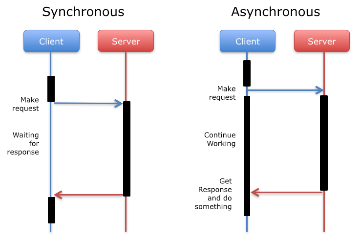

# Synchronous vs Asynchronous Explained

---

## Synchronous

Imagine you are ordering food over the phone. If you make a synchronous order, you stay on the phone, waiting for the attendant to confirm that your order has been placed and that your food is on its way. During this time, you can't do anything else because you're waiting for the response. You are blocked until the task (in this case, the order confirmation) is completed.

In programming, synchronous means that tasks are executed one at a time, and each task must be completed before moving on to the next one. Everything happens in a sequence, like waiting for the food order confirmation before doing anything else.

---

## Asynchronous

On the other hand, if you make an asynchronous order, you place the order and instead of waiting on the phone, you can do other things while waiting for the order to be processed. The attendant will call or notify you when the food is ready or on its way, and you don’t have to wait around doing nothing.

In programming, asynchronous means that tasks can be started and you don’t have to wait for one to finish before starting another. You can perform other actions while waiting for the task (like receiving the order confirmation) to be completed. This helps in not blocking other processes from running while waiting for something to finish.

---

### Key Differences:

- **Synchronous**: One task must finish before another starts. You’re blocked until the task is done.
- **Asynchronous**: You can start multiple tasks, and you don’t have to wait for one to finish before starting another. You can continue other activities while waiting for the task to complete.

---

### When to Use:

- **Synchronous**: Use when you need the result of one task before proceeding with the next.
- **Asynchronous**: Use when you want to perform other tasks while waiting for something (like a response from a server or loading data).

---

