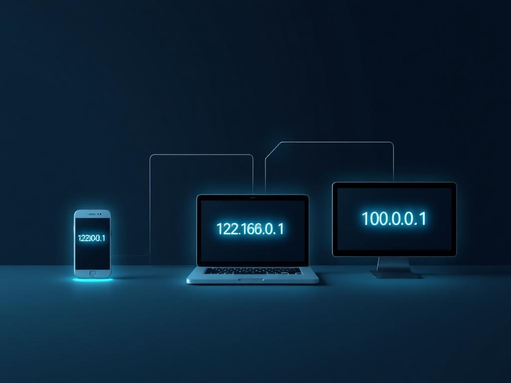

# [Web Addresses](https://www.geeksforgeeks.org/differences-between-ipv4-and-ipv6/)

Web addresses and IP addresses are fundamental for communication on the internet. A web address (also known as a URL) is the identifier that allows users to access websites easily and intuitively. For example, a web address like "www.example.com" is translated by servers into an IP address, which is a numerical sequence that uniquely identifies a device on the network.

---

**IPv4**

IPv4 (Internet Protocol version 4) is the traditional system used for addressing devices on the internet. It uses a 32-bit numerical format, which allows for about 4.3 billion unique addresses. An example of an IPv4 address would be "192.168.0.1". While it has been sufficient for many years, the rapid growth of the internet and the increase in connected devices have led to a shortage of available addresses.

**IPv6**

To resolve the limitations of IPv4, IPv6 was developed. It uses 128 bits for addresses, allowing for an almost unlimited number of unique addresses. This ensures that the increasing number of devices connected to the internet can be accommodated without concerns about address shortages. An example of an IPv6 address is "2001:0db8:85a3:0000:0000:8a2e:0370:7334".

---